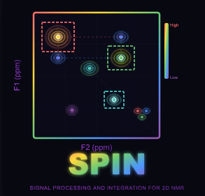

<p align="center">
  
</p>

<h1 align="center">SPIN</h1>

<p align="center">
  <strong>S</strong>ignal <strong>P</strong>rocessing and <strong>IN</strong>tegration for 2D NMR
</p>

<p align="center">
  
  
  
</p>

---

## 📋 Overview

**SPIN** is an interactive R Shiny application for analyzing 2D NMR spectra. It provides automated peak detection, manual editing tools, and batch processing capabilities for metabolomics research.

---

## 🚀 Quick Start

1. **Load** → Select your Bruker data folder
2. **Plot** → Generate contour plots
3. **Pick** → Detect peaks automatically
4. **Edit** → Refine boxes manually if needed
5. **Export** → Save results to CSV

---

## ✨ Features

### 📂 Data Loading
- Load Bruker 2D NMR data (ser/fid files)
- Batch processing of multiple spectra
- Select specific spectra to analyze
- Automatic detection of valid datasets

### 📈 Visualization
- Interactive contour plots (zoom, pan)
- Adjustable intensity threshold
- Click to get coordinates
- Real-time display of peaks and boxes

### 🎯 Peak Detection
- **Local Max method:** Local maxima + DBSCAN clustering
- **CNN method:** Deep learning detection
- Automatic bounding box generation
- Configurable clustering parameters

### ✏️ Manual Editing
- Add boxes by clicking (two-click mode)
- Move and resize existing boxes
- Delete unwanted peaks/boxes
- Fuse multiple peaks into one

---

## 🧪 Supported Spectrum Types

| Type | Description |
|------|-------------|
| **TOCSY** | Total Correlation Spectroscopy |
| **HSQC** | Heteronuclear Single Quantum Coherence |
| **COSY** | Correlation Spectroscopy |
| **UFCOSY** | Ultra-Fast COSY |

---

## 📖 Detailed Workflow

### Step 1: Load Data
Select a folder containing Bruker NMR data. The tool will automatically detect valid 2D spectra (folders containing `acqus` and `ser` or `fid` files). You can select which spectra to load using checkboxes.

### Step 2: Generate Plot
Choose the spectrum type and adjust the intensity threshold. Click **Auto** to calculate an optimal threshold based on noise level or maximum intensity. Then click **Generate Plot** to create the contour visualization.

### Step 3: Peak Picking
- **Local Max method:** Uses local maxima detection followed by DBSCAN clustering to group nearby points. Adjust `epsilon` to control cluster size.
- **CNN method:** Uses a trained convolutional neural network for peak detection. Better for complex or overlapping peaks.

### Step 4: Manual Editing
- **Add boxes:** Enable "Two clicks" mode, then click two opposite corners on the spectrum.
- **Edit boxes:** Select a box in the Data tab, then use arrow buttons to move or +/- to resize.
- **Fuse peaks:** Use the lasso tool to select multiple peaks, then click "Fuse".

### Step 5: Export Results
- **Peaks:** Export peak positions (F1, F2 coordinates) and intensities.
- **Boxes:** Export bounding box coordinates and integrated intensities.
- **Batch Export:** Apply the same boxes to all loaded spectra and export intensities for each.

---

## 💡 Tips

- Start with a QC sample or the most intense spectrum to optimize parameters
- Use "No clustering" option if you do not want to group multiplets
- Increase epsilon value to decrease size of cluster and get more solo peaks (e.g., TOCSY)
- Click "Apply" to confirm changes before exporting
- Use the "Data" tab to review and select boxes for editing
- For batch processing: select the folder, process only a QC or the most intense spectrum first (Step 1), then reload all spectra and use "Batch Export" with the peaks selected from the first spectrum

---

## 📄 Output Format

### Peaks CSV
```
stain_id, F2_ppm, F1_ppm, stain_intensity
```

### Boxes CSV
```
stain_id, xmin, xmax, ymin, ymax, stain_intensity
```

---

## 🛠️ Installation

### Prerequisites
- R (>= 4.0)
- RStudio (recommended)

### Required R packages

```r
install.packages(c(
  "shiny",
  "plotly",
  "DT",
  "dplyr",
  "dbscan"
  # Add other dependencies as needed
))
```

### Run the application

```r
# Clone the repository
# git clone https://github.com/your-username/SPIN.git

# Open RStudio and set working directory to SPIN folder
setwd("path/to/SPIN")

# Run the app
shiny::runApp()
```

---

## 📁 Project Structure

```
SPIN/
├── app.R                 # Main Shiny application
├── www/
│   └── spin.png          # Logo
├── R/
│   ├── data_loading.R    # Data import functions
│   ├── peak_detection.R  # Peak picking algorithms
│   └── visualization.R   # Plotting functions
├── models/
│   └── cnn_model.h5      # Pre-trained CNN model (if applicable)
└── README.md
```

---

## 📊 Screenshots

<!-- Add screenshots of your application here -->
<!--  -->
<!--  -->

---

## 🤝 Contributing

Contributions are welcome! Please feel free to submit a Pull Request.

1. Fork the repository
2. Create your feature branch (`git checkout -b feature/AmazingFeature`)
3. Commit your changes (`git commit -m 'Add some AmazingFeature'`)
4. Push to the branch (`git push origin feature/AmazingFeature`)
5. Open a Pull Request

---

## 📝 License

This project is licensed under the MIT License - see the [LICENSE](LICENSE) file for details.

---

## 📧 Contact

For questions or bug reports, please contact the development team or open an issue on GitHub.

---

<p align="center">
  Developed for metabolomics research
</p>
